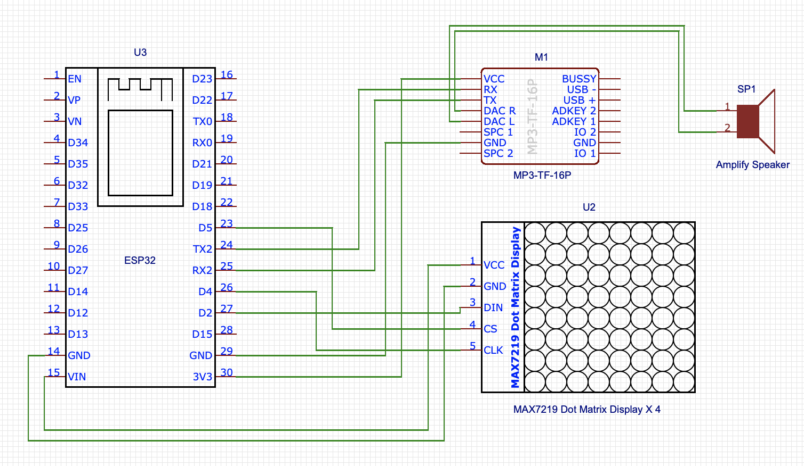

# Prayer Clock
## Hardware
- ESP32 DOIT ESP32 DEVKIT/ESP-WROOM-32
- MP3-TF-16P + SD Card 
- Max7219 Led Matrix Module X 4

## Installation

### Preperation
<ul>
    <li>USB driver for ESP32 - CP2102 </li>   
    <li>Python and PIP</li>
    <li>esptool.py - <a href="https://github.com/espressif/esptool">Tutorial</a></li>
    <li>ampy - <a href="https://github.com/pycampers/ampy">Tutorial</a></li>
    <li>micropython firmware - <a href="http://micropython.org/download">Download</a></li>
</ul>

### Erase_flash
```
esptool.py --port /dev/tty.SLAB_USBtoUART erase_flash
```

### Flash micropython firmware to ESP32
```
esptool.py --chip esp32 --port /dev/tty.SLAB_USBtoUART write_flash -z 0x1000 *.bin
```

### modify file wifi.txt
```
  [ssid],[password]
```

### Upload *.py and wifi.txt to ESP32
```
ampy --port /dev/tty.SLAB_USBtoUART put [xxxxxx.py]
```

# Schematic
<p align="center">
  
</p>